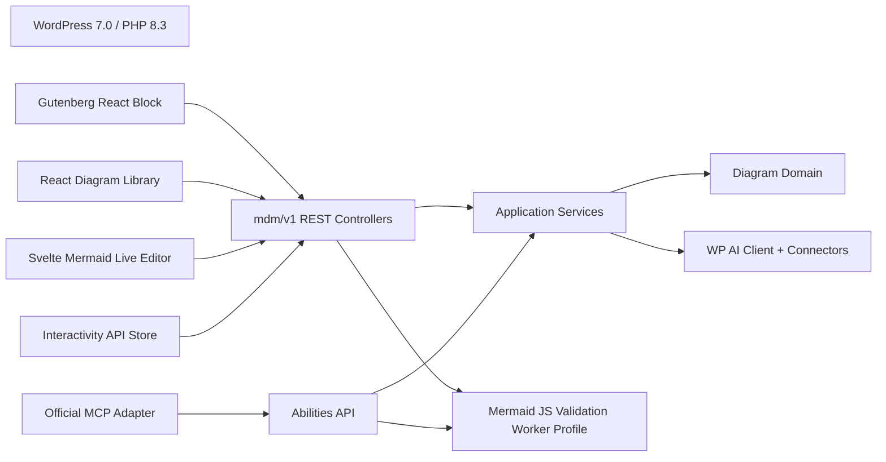

# 2. Enterprise Plugin Architecture

## 2.1 Architectural style

Use a **modular monolith** with explicit bounded contexts and dependency direction. This gives the plugin one deployable ZIP while preventing WordPress hooks, REST controllers, React screens, and Mermaid rendering from becoming one tightly coupled codebase.

The recommended internal style combines:

- Domain-driven module boundaries for diagrams, taxonomy management, rendering, exports, settings, and blocks;
- Ports and adapters for persistence, Mermaid rendering, exports, and visual editing;
- Command/query separation at the application-service level without introducing a full event-sourcing framework;
- WordPress-native integration at the outer infrastructure layer;
- Two React application entry points, one adapted Svelte editor application, and one front-end Interactivity API entry point.

This is intentionally more structured than a small plugin, but lighter than a generic framework.

## 2.2 Runtime components

### PHP backend

Responsibilities:

- plugin bootstrap and compatibility checks;
- dependency wiring and service registration;
- CPT, taxonomy, meta, capabilities, rewrite, and block registration;
- REST routes and permission callbacks;
- diagram persistence through WordPress APIs;
- dynamic block rendering;
- settings schema and storage;
- migrations and uninstall behavior;
- cache keys and invalidation;
- server-side source validation that can be performed safely without executing a browser renderer;
- usage/reference queries and administrative diagnostics.

### React application 1 — Gutenberg block application

Responsibilities:

- inline code editing and preview;
- library selector;
- save-to-library workflow;
- reference-mode preview and controls;
- block attributes and transforms;
- editor-only downloads and larger preview.

### React application 2 — Diagram Library

Responsibilities:

- launch table/list presentation; a grid is deferred;
- search, filters, pagination, and sorting;
- preview panel;
- bulk actions;
- category/tag management surfaces;
- duplicate, trash, restore, and navigation to editor.

### Svelte application — Mermaid Live Editor integration

Responsibilities:

- source editing and live Mermaid preview;
- title, description, categories, tags, theme, and status editing;
- coordinated source-plus-featured-SVG save;
- revision, local recovery, and optimistic conflict workflows;
- source/SVG export;
- AI candidate and review actions through WordPress AI APIs;
- later visual editor adapter entry point.

### Front-end Interactivity API module

Responsibilities:

- initialize diagrams emitted by the dynamic block;
- lazy-load or invoke Mermaid rendering;
- zoom, pan, fit, reset, fullscreen, and download actions;
- per-block interaction state and shared runtime state;
- accessibility announcements;
- graceful isolation when one diagram fails.

It is a fourth JavaScript entry point, but not a fourth React application.

## 2.3 Dependency direction

```text
Presentation (REST, Block PHP, Admin pages)
        ↓
Application (commands, queries, DTOs, policies)
        ↓
Domain (entities, value objects, invariants, interfaces)
        ↑
Infrastructure (WordPress repositories, settings, caches, assets)
```

Rules:

- Domain code does not call WordPress global functions.
- Application services depend on domain interfaces.
- Infrastructure implements repositories and gateways using WordPress APIs.
- Presentation converts HTTP, hook, and block inputs to application commands/queries.
- React applications depend on TypeScript API clients and shared UI/domain types, not on each other’s component trees.
- Shared packages must not become a dumping ground; each shared module needs a clear reason and owner.

## 2.4 Proposed plugin folder structure

```text
mermaid-diagrams/
├── mermaid-diagrams.php
├── uninstall.php
├── readme.txt
├── composer.json
├── composer.lock
├── package.json
├── package-lock.json | pnpm-lock.yaml
├── phpcs.xml.dist
├── phpstan.neon.dist
├── playwright.config.ts
├── blocks/
│   └── diagram/
│       ├── block.json
│       ├── render.php
│       └── deprecated.php                 # only after schema migrations are needed
├── src/
│   ├── Bootstrap/
│   │   ├── Plugin.php
│   │   ├── ServiceProvider.php
│   │   ├── ServiceProviderRegistry.php
│   │   ├── Activation.php
│   │   ├── Deactivation.php
│   │   └── Compatibility.php
│   ├── Diagram/
│   │   ├── Domain/
│   │   │   ├── Diagram.php
│   │   │   ├── DiagramId.php
│   │   │   ├── DiagramSource.php
│   │   │   ├── DiagramType.php
│   │   │   ├── DiagramStatus.php
│   │   │   ├── DiagramVersion.php
│   │   │   ├── DiagramRepository.php
│   │   │   ├── DiagramPolicy.php
│   │   │   └── Exception/
│   │   ├── Application/
│   │   │   ├── Command/
│   │   │   │   ├── CreateDiagram.php
│   │   │   │   ├── UpdateDiagram.php
│   │   │   │   ├── DuplicateDiagram.php
│   │   │   │   ├── TrashDiagram.php
│   │   │   │   └── BulkAssignTerms.php
│   │   │   ├── Query/
│   │   │   │   ├── GetDiagram.php
│   │   │   │   ├── SearchDiagrams.php
│   │   │   │   └── GetDiagramUsage.php
│   │   │   ├── DTO/
│   │   │   └── Service/
│   │   └── Infrastructure/
│   │       ├── WordPressDiagramRepository.php
│   │       ├── DiagramPostType.php
│   │       ├── DiagramTaxonomies.php
│   │       ├── DiagramCapabilities.php
│   │       ├── DiagramRevisionSupport.php
│   │       └── DiagramCache.php
│   ├── Rendering/
│   │   ├── Domain/
│   │   │   ├── RenderOptions.php
│   │   │   ├── RenderPayload.php
│   │   │   └── RenderCacheKey.php
│   │   ├── Application/
│   │   │   └── BuildRenderPayload.php
│   │   └── Infrastructure/
│   │       ├── RenderPayloadSerializer.php
│   │       └── AssetLoader.php
│   ├── Export/
│   │   ├── Domain/
│   │   │   ├── ExportFormat.php
│   │   │   └── ExportPolicy.php
│   │   ├── Application/
│   │   └── Infrastructure/
│   ├── Settings/
│   │   ├── Domain/
│   │   ├── Application/
│   │   └── Infrastructure/
│   │       ├── SettingsRepository.php
│   │       └── SettingsSchema.php
│   ├── Rest/
│   │   ├── Controller/
│   │   │   ├── DiagramCollectionController.php
│   │   │   ├── DiagramItemController.php
│   │   │   ├── DiagramBulkController.php
│   │   │   ├── DiagramUsageController.php
│   │   │   ├── DiagramExportController.php
│   │   │   └── SettingsController.php
│   │   ├── Schema/
│   │   ├── Permission/
│   │   └── RestServiceProvider.php
│   ├── Block/
│   │   ├── DiagramBlock.php
│   │   ├── DiagramBlockRenderer.php
│   │   ├── BlockAttributes.php
│   │   └── BlockServiceProvider.php
│   ├── Admin/
│   │   ├── AdminMenu.php
│   │   ├── AdminRoute.php
│   │   ├── AdminAssets.php
│   │   └── ScreenBootstrapData.php
│   ├── Support/
│   │   ├── Clock.php
│   │   ├── Json.php
│   │   ├── Result.php
│   │   └── WordPressErrorMapper.php
│   └── Upgrade/
│       ├── UpgradeRunner.php
│       └── Migration/
├── assets/
│   └── src/
│       ├── apps/
│       │   ├── block-editor/
│       │   ├── diagram-library/
│       │   └── diagram-editor/
│       ├── frontend/
│       │   └── interactivity/
│       ├── shared/
│       │   ├── api/
│       │   ├── components/
│       │   ├── domain/
│       │   ├── export/
│       │   ├── mermaid/
│       │   ├── state/
│       │   ├── styles/
│       │   └── testing/
│       └── visual-editor/
│           ├── core/
│           └── adapters/
│               └── flowchart/
├── build/
│   ├── blocks/diagram/
│   ├── admin/library/
│   ├── admin/editor/
│   ├── admin/settings/
│   ├── frontend/
│   └── manifest.json
├── languages/
├── templates/
│   └── admin-app-root.php
├── tests/
│   ├── phpunit/
│   │   ├── unit/
│   │   ├── integration/
│   │   └── rest/
│   ├── js/
│   │   ├── unit/
│   │   ├── components/
│   │   └── adapters/
│   └── fixtures/
├── playwright/
│   ├── fixtures/
│   ├── helpers/
│   └── tests/
├── tools/
│   ├── build-plugin-zip.mjs
│   ├── create-test-data.php
│   └── verify-dist.php
└── docs/
    └── adr/
```

## 2.5 Bootstrap pattern

The root plugin file should do very little:

1. guard direct access;
2. define version and paths;
3. load Composer autoloading;
4. run compatibility checks;
5. instantiate the plugin bootstrap;
6. register activation, deactivation, and uninstall integration.

Do not register every hook in the root file. Use service providers with one responsibility each.

A minimal provider contract:

```php
interface ServiceProvider {
    public function register( Container $container ): void;
    public function boot(): void;
}
```

A small purpose-built container is acceptable. Do not add a large general framework solely for dependency injection.

## 2.6 Bounded contexts

### Diagram context

Owns identity, source, title, description, status, ownership, terms, versions, and diagram lifecycle.

### Rendering context

Builds safe render payloads and cache keys. It does not own the diagram record and does not directly mutate it.

### Export context

Owns filename rules, permitted formats, source retrieval policy, and export metadata. Browser source/SVG generation is implemented in shared JavaScript, while REST may provide source or authorization-aware metadata.

### Block context

Translates block attributes to a render request and emits stable semantic markup. It depends on diagram queries and rendering services.

### Settings context

Owns schema, defaults, normalization, storage, and migration of plugin settings.

### Visual-editor context

Lives mainly in TypeScript. It owns adapter contracts, intermediate representation, capability checks, serialization, and loss reporting.

## 2.7 WordPress-native infrastructure

Use WordPress where it already provides reliable behavior:

- CPT storage, status, authorship, revisions, trash, and dates;
- taxonomy storage and term relationships;
- capability mapping;
- REST authentication and nonce handling;
- block registration through `block.json`;
- dynamic PHP rendering;
- script modules and Interactivity API;
- object cache and transients where appropriate;
- internationalization;
- WP-Cron only for non-critical optional maintenance tasks.

Avoid recreating generic ORM, revision, role, or routing systems inside the plugin.

## 2.8 JavaScript workspace architecture

### Shared rules

- TypeScript strict mode.
- Import React functionality through WordPress-supported packages where the runtime is WordPress-owned.
- Do not ship a second React runtime into WordPress admin.
- Generate or maintain shared REST DTO types from one documented schema source.
- Use `@wordpress/api-fetch` with nonce middleware for admin REST calls.
- Keep server-normalized responses authoritative after mutations.
- Use `AbortController` for searches and previews.
- Keep application-specific state local; use a small store only where cross-component coordination warrants it.
- Avoid a plugin-wide global state store that couples all entry points.

### Entry points

```text
block-editor/index.tsx
  -> registerBlockType
  -> Gutenberg edit component

diagram-library/index.tsx
  -> mount into #mdm-diagram-library-root
  -> ThemeProvider + application shell

diagram-editor/index.tsx
  -> mount into #mdm-diagram-editor-root
  -> EditorSession state machine

frontend/interactivity/index.ts
  -> store('mdm/diagram', ...)
  -> Mermaid render service
  -> pan/zoom/download actions
```

### `plugin-ui` boundary

Wrap external UI-library components behind thin local abstractions when they are foundational to the product, for example:

```text
shared/components/AppButton.tsx
shared/components/AppModal.tsx
shared/components/AppSearchInput.tsx
shared/components/AppToast.tsx
```

This is not pointless duplication. It provides:

- one place for WordPress accessibility fixes;
- one place for styling and version adaptation;
- lower switching cost if `plugin-ui` changes;
- a stable internal API for application code.

Do not wrap every primitive indiscriminately.

## 2.9 Dynamic block architecture

The block must register server-side from `block.json` and use a `render.php` adapter that delegates to a class. `render.php` must not declare shared functions because it executes once per block instance.

Recommended output shape:

```html
<figure
  class="wp-block-mdm-diagram"
  data-wp-interactive="mdm/diagram"
  data-wp-context='{"instanceId":"...","initialZoom":1}'
>
  <figcaption>...</figcaption>
  <div class="mdm-diagram__viewport" data-wp-init="actions.init">
    <div class="mdm-diagram__canvas" data-wp-ref="canvas"></div>
  </div>
  <div class="mdm-diagram__toolbar">...</div>
  <script type="application/json" class="mdm-diagram__payload">...</script>
  <p class="mdm-diagram__fallback">Readable title and description...</p>
</figure>
```

The serialized payload should include only what the renderer needs:

- unique instance ID;
- canonical source;
- safe normalized config;
- title and description;
- allowed controls and formats;
- source hash and Mermaid runtime version;
- public-safe error state if the reference cannot be resolved.

Large source should be encoded as JSON text rather than a long HTML data attribute.

## 2.10 Rendering service architecture

Create one framework-neutral Mermaid runtime package used through thin adapters by the two React applications, the Svelte editor application, and the Interactivity API module where bundling permits:

```ts
interface MermaidRenderer {
  validate(source: string): Promise<ValidationResult>;
  render(request: RenderRequest): Promise<RenderResult>;
  detectType(source: string): Promise<string | null>;
}
```

The implementation must:

- initialize Mermaid once per runtime with locked security defaults;
- create collision-free render IDs;
- reject stale async results through generation tokens;
- return structured diagnostics;
- sanitize exported SVG;
- never mutate application state directly;
- support test doubles.

Mermaid initialization is global within a JS realm, so diagram-specific configuration must be normalized carefully. Avoid uncoordinated `initialize()` calls from each component.

## 2.11 REST architecture

Prefer WordPress core endpoints for ordinary CPT and taxonomy operations where their payload and permissions are adequate. Add custom routes for:

- compact library search projection;
- combined diagram detail optimized for the editor;
- bulk term/status operations;
- duplication;
- usage/reference lookup;
- conflict-aware update semantics;
- settings schema and section-scoped updates;
- export authorization/metadata if needed.

Each custom controller should extend `WP_REST_Controller` where that improves consistency. Every endpoint has:

- namespaced route;
- explicit methods;
- JSON schema for arguments and response shape;
- validation and sanitization;
- `permission_callback` based on capabilities and object ownership;
- stable `WP_Error` codes;
- tests for unauthorized, invalid, successful, and conflict cases.

## 2.12 Data-flow examples

### Select existing diagram in Gutenberg

```text
Block selector
  -> GET /mdm/v1/diagrams?search=&category=&page=
  -> DiagramCollectionController
  -> SearchDiagrams query
  -> WordPressDiagramRepository
  -> summary DTOs
  -> user selects item
  -> block attributes { mode: 'reference', diagramId: 123 }
```

### Front-end reference rendering

```text
WordPress parses post
  -> DiagramBlockRenderer
  -> GetDiagram query with public-read policy
  -> BuildRenderPayload
  -> semantic HTML + JSON payload
  -> browser loads viewScriptModule only because block is present
  -> Interactivity action initializes Mermaid
  -> SVG inserted into canvas
  -> toolbar actions operate on per-instance context
```

### Conflict-aware editor save

```text
Editor loads diagram with version token V7
  -> user edits
  -> PUT /mdm/v1/diagrams/123 { ..., expectedVersion: V7 }
  -> UpdateDiagram command
  -> repository compares current V8
  -> HTTP 409 mdm_edit_conflict
  -> client offers reload, compare, or duplicate
```

## 2.13 Caching

Use a deterministic cache key:

```text
mdm-render:{diagramId}:{sourceHash}:{configHash}:{mermaidVersion}:{rendererSchemaVersion}
```

Cache only safe derived metadata or sanitized render results when that is proven beneficial. Initial implementation can cache:

- detected type;
- validation status and diagnostic summary;
- lightweight preview data;
- usage counts with short TTL.

Browser rendering remains the default. Do not prematurely store generated SVG as the canonical representation.

Invalidate related caches on diagram save, term changes, trash/restore, relevant settings changes, and Mermaid runtime upgrades.

## 2.14 Migrations and versioning

Store a plugin database/schema version option. Every migration is:

- idempotent;
- ordered;
- testable;
- safe to resume;
- free of long synchronous loops on normal admin requests.

For large data migrations, use batched background processing or WP-CLI. Activation should register types, assign capabilities, set defaults, and schedule necessary migration work, but should not perform expensive full-library transformations.

Block attribute schema changes require Gutenberg deprecations and migrations. REST breaking changes require a new namespace version or backward-compatible expansion.

## 2.15 Distribution package

The production ZIP must contain:

- PHP source required at runtime;
- Composer production dependencies if any;
- built JS/CSS assets and `.asset.php` dependency manifests;
- block metadata and render adapter;
- translations;
- license notices for included or adapted code;
- `readme.txt` and changelog.

It must not contain:

- `node_modules`;
- development-only Composer packages;
- source maps unless intentionally distributed;
- test fixtures with secrets;
- local editor configuration;
- repository metadata;
- raw third-party applications copied wholesale without need.

The CI release job should build from a clean checkout and verify the ZIP by installing it into a fresh WordPress environment.

## 2.18 Final runtime topology



### Framework boundary

`packages/contracts` contains request/response schemas, identifiers, error codes, and framework-neutral TypeScript. React and Svelte each own their state layer. Shared UI components are not forced across frameworks; tokens and contracts are shared instead.

### Persistence boundary

REST controllers and abilities are adapters. They may not write posts/meta/terms directly. They call application commands/queries, which use WordPress repository adapters. This preserves one authorization/business-rule path for human and agent clients.

### Validation profiles

- **Browser profile:** required for Gutenberg, Library quick-create, and Live Editor saves.
- **Worker profile:** required for direct MCP/AI mutations. It runs the same pinned Mermaid package and returns signed/internal validation results.
- **Candidate-only profile:** if the worker is unavailable, external agents can generate or repair source but cannot persist it.
