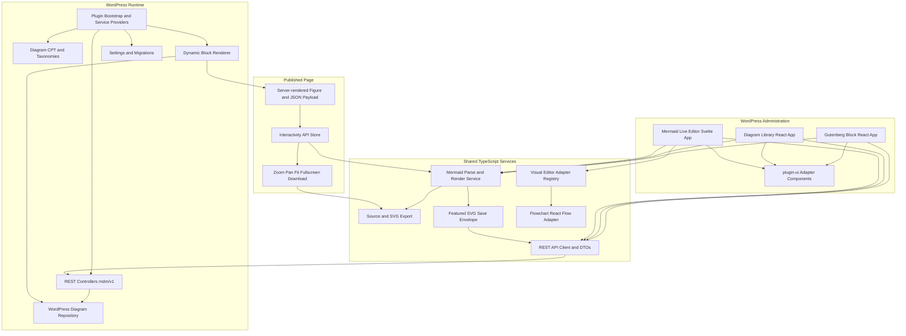
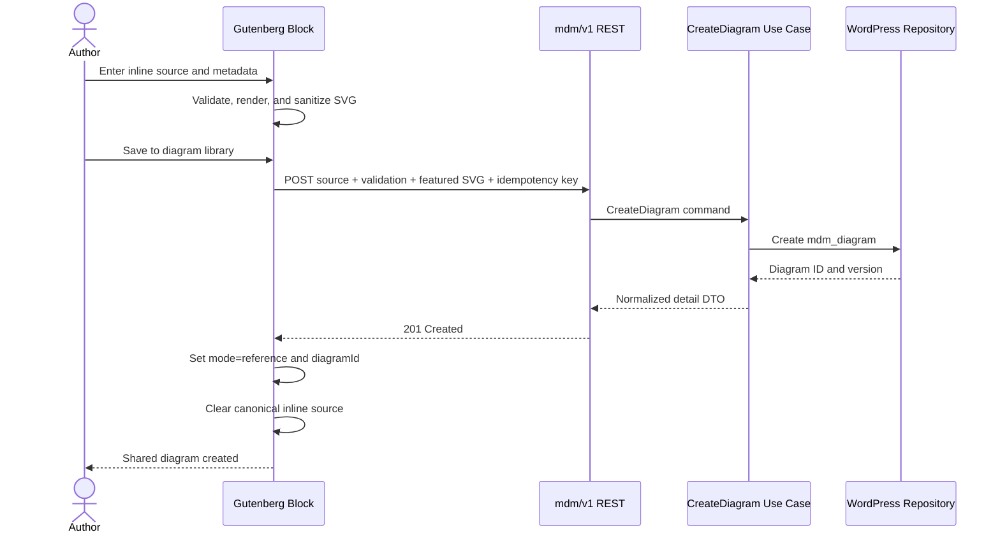
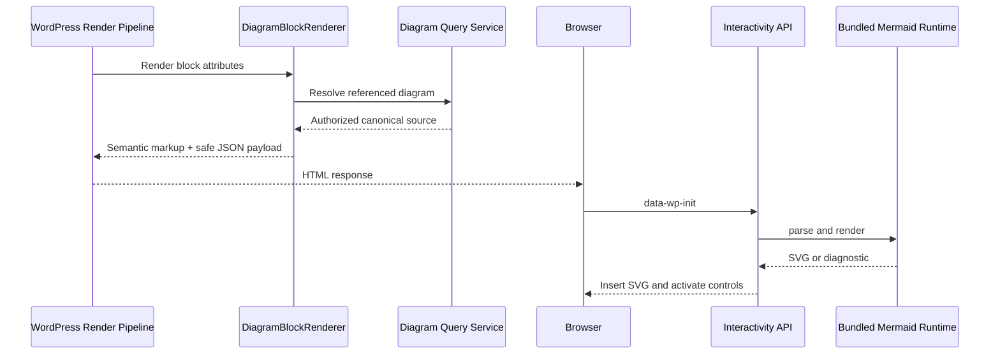
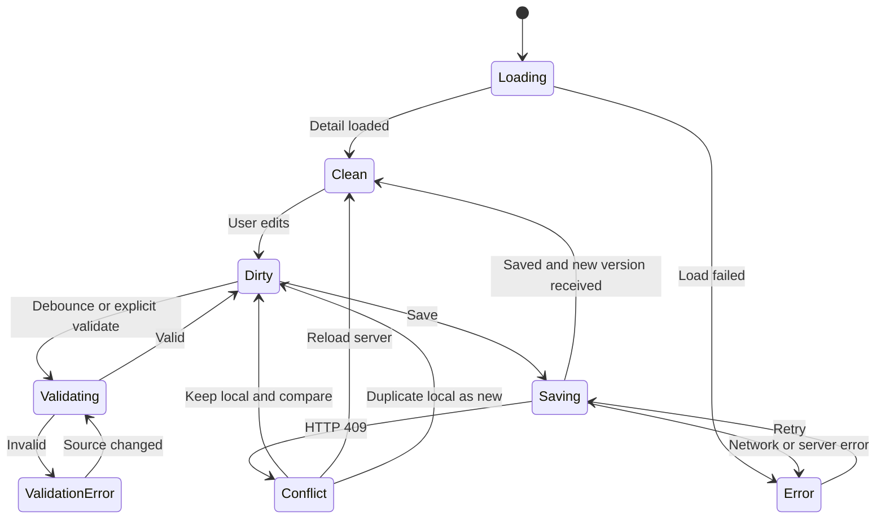
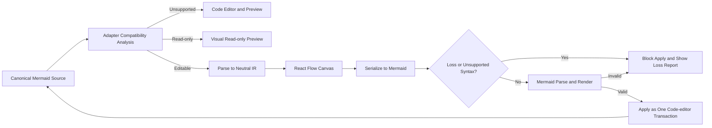
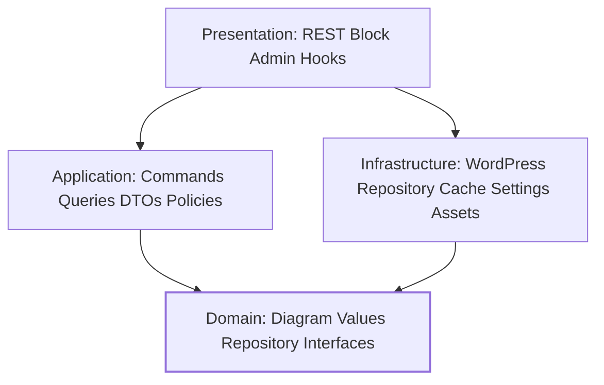

# Architecture Overview Diagrams

These diagrams are explanatory architecture models for the implementation team. They are not generated plugin content.

## Component view

## Inline-to-library conversion

## Reference rendering

## Dedicated editor save and conflict

## Visual editor safety boundary

## PHP dependency direction

